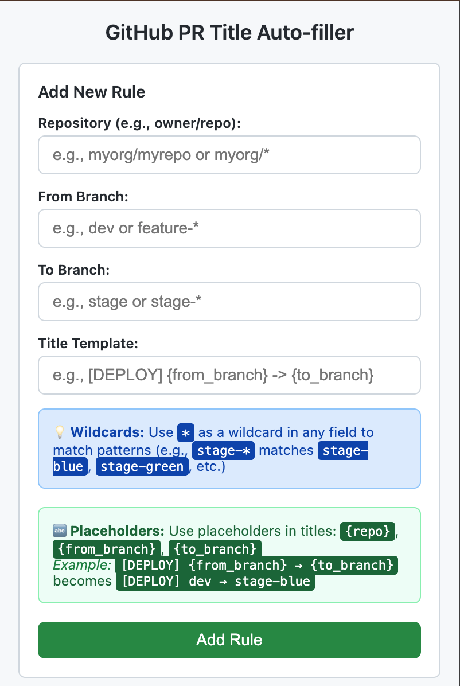
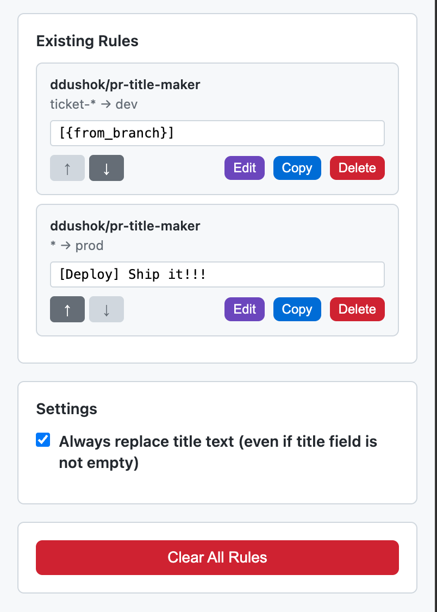
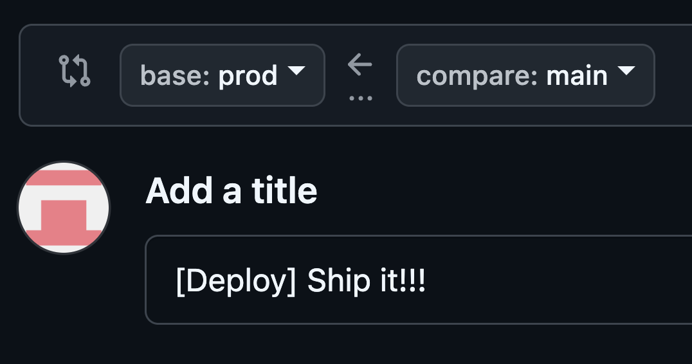

# GitHub PR Title Auto-filler Chrome Extension

A Chrome extension that automatically fills in GitHub pull request titles based on configurable patterns matching repository, source branch, and target branch.





## Features

- ✅ **Pattern Matching**: Configure rules based on repository, from branch, and to branch
- ✅ **Multiple Rules**: Support for unlimited custom rules
- ✅ **Flexible Replacement**: Choose to always replace titles or only fill empty fields
- ✅ **Visual Feedback**: Shows notifications when titles are auto-filled
- ✅ **Easy Management**: Simple popup interface to add, view, and delete rules

## Installation

### Option 1: Load as Unpacked Extension (Development)

1. **Download/Clone** this repository to your local machine
2. **Open Chrome** and navigate to `chrome://extensions/`
3. **Enable Developer Mode** by toggling the switch in the top right
4. **Click "Load unpacked"** and select the folder containing the extension files
5. The extension should now appear in your extensions list and be ready to use

### Option 2: Create ZIP for Distribution

1. Create a ZIP file containing all the extension files:
   - `manifest.json`
   - `popup.html`
   - `popup.js` 
   - `popup.css`
   - `content.js`
   - `background.js`

## Usage

### 1. Configure Rules

1. **Click the extension icon** in your Chrome toolbar
2. **Fill in the rule form**:
   - **Repository**: Enter in format `owner/repo` (e.g., `microsoft/vscode`)
   - **From Branch**: The source branch name (e.g., `dev`, `feature-branch`)
   - **To Branch**: The target branch name (e.g., `main`, `stage`)
   - **Title Template**: The title to auto-fill (e.g., `[DEPLOY] dev -> stage`)
3. **Click "Add Rule"** to save

### 2. Using the Extension

1. **Navigate to GitHub** and start creating a pull request
2. **Go to the compare page** (e.g., `github.com/owner/repo/compare/main...dev`)
3. The extension will **automatically detect** the repository and branches
4. If a **matching rule is found**, the title field will be auto-filled
5. A **green notification** will appear confirming the auto-fill

### 3. Managing Rules

- **View existing rules** in the extension popup
- **Delete individual rules** using the Delete button next to each rule
- **Clear all rules** using the "Clear All Rules" button

### 4. Settings

- **Always Replace**: By default, the extension will replace any existing text in the title field
- **Uncheck "Always replace"**: To only fill empty title fields (won't overwrite existing titles)
- **Setting is saved** automatically when changed

## Examples

Here are some common use cases:

### Deployment Rules
```
Repository: myorg/webapp
From Branch: dev
To Branch: staging  
Title: [DEPLOY] dev -> staging
```

### Feature Integration
```
Repository: myorg/api
From Branch: feature-auth
To Branch: develop
Title: feat: integrate authentication system
```

### Hotfix Rules
```
Repository: myorg/frontend
From Branch: hotfix-critical-bug
To Branch: main
Title: [HOTFIX] Critical bug fix
```

## How It Works

1. **Content Script Detection**: The extension runs on GitHub pages matching `/compare/*` and `/pull/new/*`
2. **Repository & Branch Extraction**: Automatically extracts repo and branch info from the URL and page content
3. **Rule Matching**: Compares extracted info against your configured rules (case-insensitive)
4. **Safe Auto-fill**: Only fills empty title fields to avoid overwriting user input
5. **Visual Feedback**: Shows success notifications when titles are auto-filled

## Technical Details

### Files Structure
```
github-helper/
├── manifest.json      # Extension configuration
├── popup.html         # Configuration UI
├── popup.js          # Popup functionality  
├── popup.css         # Popup styling
├── content.js        # GitHub page interaction
├── background.js     # Service worker
└── README.md         # This file
```

### Permissions Used
- `storage`: To save your configured rules
- `activeTab`: To interact with GitHub pages
- `https://github.com/*`: To run on GitHub URLs

### Browser Compatibility
- **Chrome**: Fully supported (Manifest V3)
- **Edge**: Should work (Chromium-based)
- **Firefox**: Would need conversion to Manifest V2

## Troubleshooting

### Title Not Auto-filling?
1. **Check the console** (F12 → Console) for "PR Title Auto-filler" messages
2. **Verify your rule** matches exactly (check repository format: `owner/repo`)
3. **Ensure title field is empty** (extension won't overwrite existing text)
4. **Try refreshing** the GitHub page

### Extension Not Loading?
1. **Check Chrome extensions page** (`chrome://extensions/`)
2. **Verify all files** are present in the extension folder
3. **Look for errors** in the extensions page
4. **Try reloading** the extension

### Rules Not Saving?
1. **Check browser storage permissions**
2. **Try clearing extension data** and reconfiguring
3. **Verify popup opens** correctly when clicking the extension icon

## Development

To modify or extend the extension:

1. **Edit the files** as needed
2. **Go to `chrome://extensions/`**
3. **Click the refresh icon** on the extension card
4. **Test your changes** on GitHub

### Key Functions
- `content.js`: Main logic for detecting PR pages and auto-filling
- `popup.js`: Rule management and storage operations
- `background.js`: Extension lifecycle and coordination

## Contributing

Feel free to submit issues, feature requests, or pull requests to improve the extension!

## License

This project is open source and available under the MIT License.